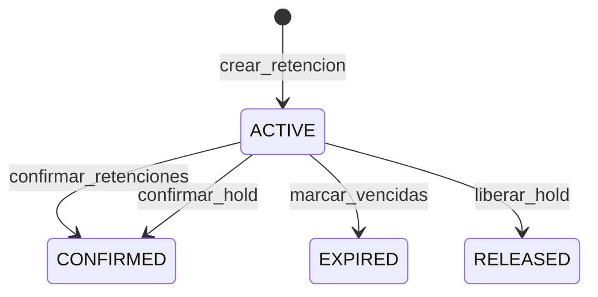

# Estados de una retención

<!-- DOCUMENTO DERIVADO — NO EDITAR A MANO -->
<!-- Se regenera con: python herramientas/generar_diagrama_estados.py -->

Este archivo representa el código vigente. No define reglas nuevas: las
reglas asociadas viven en `docs/contrato/reglas.md` y se referencian por
identificador.

## Productores detectados

| Estado | Producido por |
|---|---|
| `ACTIVE` | `crear_retencion` en `app/infrastructure/repository.py` |
| `CONFIRMED` | `confirmar_retenciones` en `app/api/routes.py`; `confirmar_hold` en `app/infrastructure/repository.py` |
| `EXPIRED` | `marcar_vencidas` en `app/infrastructure/repository.py` |
| `RELEASED` | `liberar_hold` en `app/infrastructure/repository.py` |

## Supuestos del análisis

- `ACTIVE --> CONFIRMED` (confirmar_retenciones en `app/api/routes.py`): el análisis detecta la asignación del estado destino pero no puede determinar el estado de origen. Se asume `ACTIVE`.
- `ACTIVE --> CONFIRMED` (confirmar_hold en `app/infrastructure/repository.py`): el análisis detecta la asignación del estado destino pero no puede determinar el estado de origen. Se asume `ACTIVE`.
- `ACTIVE --> EXPIRED` (marcar_vencidas en `app/infrastructure/repository.py`): el análisis detecta la asignación del estado destino pero no puede determinar el estado de origen. Se asume `ACTIVE`.
- `ACTIVE --> RELEASED` (liberar_hold en `app/infrastructure/repository.py`): el análisis detecta la asignación del estado destino pero no puede determinar el estado de origen. Se asume `ACTIVE`.

## Límite de la herramienta

El generador lee la estructura del código sin ejecutarlo. Puede afirmar
qué encontró; no puede afirmar que no exista lo que no encontró.
